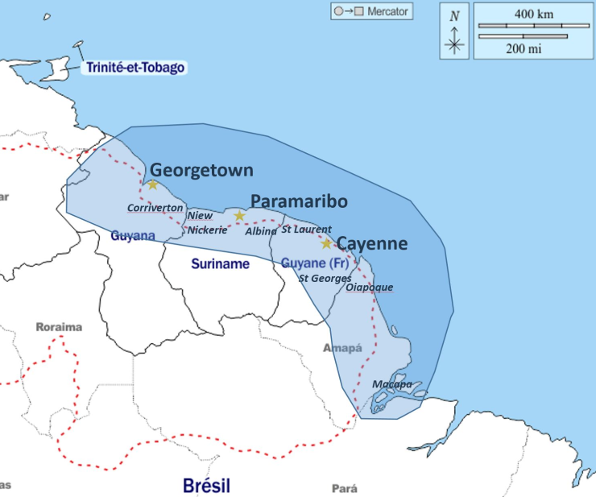

# Progysat
PROGYSAT s’inscrit dans le cadre du financement européen du Programme de Coopération Interreg Amazonie (PCIA) qui participe au développement intégré de la Guyane Française et de ses voisins du Plateau des Guyanes – le Suriname, le Guyana, l’Amapá, le Pará et l’Amazonas.

# Objectifs
Le but de ce projet est de développer une chaine de traitement URBATEX à partir des données de télédétection pour le suivi des zones urbaines avec pour les 4 pays des informations comparables aux échelles :

11 Villes retenues : elles correspondent à 3 contextes géographiques :

# Données utilisées :
 * Images Landsat 4/5, 7 et 8
 * Images Sentinel S2
 
# Sommaire : 
### Méthode de désennuagement :
 * Calcul_pourcentage_nuage : Calcul du pourcentage de nuage sur les zones urbaines.
 * Creation_Masque_Nuage_Landsat : Création des masques de nuage pour les données Landsat.  
 * Creation_Masque_Nuage_SentinelS2_MAJA : Création des masques de nuage pour les données Sentinel S2 MAJA. 
 * TimeSerieImageGapFilling_SentinelS2 : Création d'une image sans nuages avec la méthode du GapFilling.
 
## Extraction de la Tache urbaine :  
 * Extraction_Zone_Urbaine : Extraction de la zone urbaine à l'aide de l'algorithme de texture fototex.
 
 
 
# Development and improvement
 * Youssef Fouzai
 * Laurent Demagistri
 * Cyril Bernard
 * Adrien Andre
 * Equipe FOTOTEX (https://framagit.org/benjaminpillot/fototex)
# Conceptualization and Coordination
 * Nadine Dessay
 * Laurent Demagistri
 * Youssef Fouzai

# Scientific projects
 * PCIA PROGYSAT project, funded by Interreg Amazon Cooperation Program (Urban axis) - (2021-2023)
 * TOSCA DELICIOSA project, funded by CNES (TOSCA 2020-2022)

