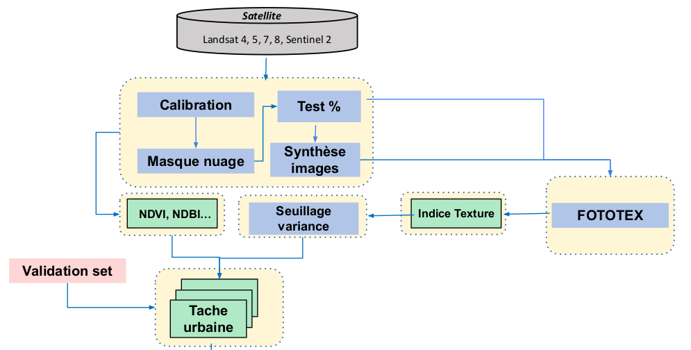

# Progysat
PROGYSAT s’inscrit dans le cadre du financement européen du Programme de Coopération Interreg Amazonie (PCIA) qui participe au développement intégré de la Guyane Française et de ses voisins du Plateau des Guyanes – le Suriname, le Guyana, l’Amapá, le Pará et l’Amazonas.

# Objectifs
Le but de ce projet est de développer une chaine de traitement qui traite en entrée les données Landsat et Sentinel2 pour suivre et extraire les zones urbaines.





# Données utilisées :
 * Images Landsat 4/5, 7 et 8
 * Images Sentinel S2
 
# Sommaire : 
### Les différents modules de la chaine de traitement : 

**1-   Calibration :** Calibrer les images Sentinel 2 et Landsat  ( à venir )
 
**2-   Masque Nuage :** Fonction qui créé des masques de nuages binaire à partir des fichiers CLM pour les données sentinel 2 issues de Maja et les fichiers QA_Pixel pour les données Landsat
 
creation_masque_nuage_chaine de traitement(dataset, output, c_mask) 


**3-   Test :** Calculer les pourcentages de nuage d'une base de données d'images sur une zone d'intérêt et renvoi un fichier csv avec les identifiants des images et les pourcentages de nuages.
 
Calcul_pourcentage_nuage_chaine_traitement(dataset, geom_path)
 
**4-  Synthèse images :** Création d'une images sans nuages à partir d'une serie temporelle d'images avec la méthode GapFilling
  
GapFilling(image_directory, mask_directory, output_file, output_date)
 
**5-   FOTOTEX + Inidce de texture :** Calculer des indices de texture avec l'algorithme FOTOTEX, puis traiter ces indices (i-calcul de variance ii-Seuillage de la variance iii-operations morphologiques) de textures pour extraire la tache urbaine de la zone

fototex_chaineTraitement(input_raster, output_directory, w_size_f, methode_foto, w_size_v, threshold)
  
**Remarque :** Les differents modules de la chaine de traitement sont codés de tels sorte que chaque module peut etre utilisé séparément.
 
# CHAINE DE TRAITEMENT :  
## USAGE : 

```
print ("hello world")

```

